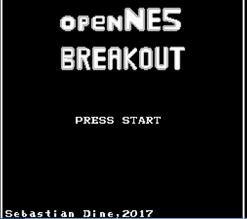
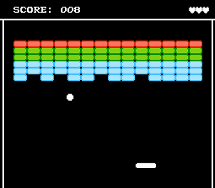

# openNES Breakout
## Rebuilding classic games for the NES as Open Source  
 
## Project Description
This is the third entry of the openNES project series which aims to rebuild classic video games for the Nintendo 
Entertainment System as open source projects.
The purpose of these projects is to get more enthusiastic people into programming for the NES by providing code examples
and a starting point for making new games from the scratch.

This particular project aims to rebuild the classic game Breakout. The code is loosely based on the [nesdoug tutorial series](https://nesdoug.com/).

The project has been written completely in C (except some Assembler functionalites from the nesdoug tutorial series) using the cc65 cross compiler (for further references see the Toolkit section).

## License
This project is licensed under the zlib license. See also the attached [LICENSE](./LICENSE) file.

## Toolkit
* [cc65 cross compiler v.2.5](https://github.com/cc65/cc65) - A freeware C compiler for 6502 based systems

* [JetBrains CLion v.2017.1.1](https://www.jetbrains.com/clion/) - a powerful and easy to use IDE for C/C++ programming

* [Tile Molester v.0.16](http://www.romhacking.net/utilities/109/) - A tileset editor, for designing tiles/sprites

* [NES Screen Tool v.2.04](https://shiru.untergrund.net/software.shtml) - A tool that allows to create and edit NES nametables, attributes, palettes, patterns (tiles), and metasprites

* [FamiTracker v.0.4.2](http://famitracker.com) - Famous tracker for producing music for the NES/Famicom-systems

* [FamiTone2 v.1.15](https://shiru.untergrund.net/code.shtml) - Lightweight Audio library for music and sound effects. 

* [Doxygen v.1.8.12](http://www.stack.nl/~dimitri/doxygen/) - Code documentation tool for C/C++ projects

* [FCEUX v.2.2.3](http://www.fceux.com/web/home.html) - Famous NES emulator in the homebrew scene with many debugging utilities.

* [nesdoug tutorial series](https://nesdoug.com/) - A great tutorial series which teaches you how to program the NES with C, only using the cc65 cross compiler.

* [NesDev Forum](http://forums.nesdev.com/) - You will always find friendly, skilled and helpful people in this community, who are willing to help with problems you are facing during your project.

* [Nerdy Nights tutorial series](http://nintendoage.com/pub/faq/NA/index.html?load=nerdy_nights_out.html) - Even if it is based on introducing you to assembly, this is the classic lecture for understanding the NES architecture for many years.

## How-To Built
To build the software into an .NES rom, you need to have installed cc65 on your local machine in order to run the script `build/build.bat` for Windows based systems. You always find a build of the master-branch at `build/breakout.nes`.

## Notes for Contributors
Feel free to fork this project and extend its content. If you find bugs, please submit them as issues so we can discuss together how you can fix them. 
All your contributions need to include explaining Doxygen comments in order to share your knowledge with future contributors and maintaining the project's code documentation.
